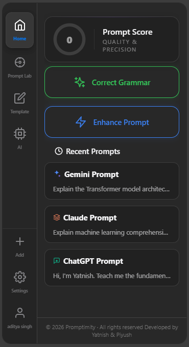

# Promptimity 🚀

**Promptimity** is a Chrome extension that helps users create better AI prompts, save their favorite prompts, and reuse them whenever needed. Whether you're using ChatGPT, Claude, Gemini, or other AI assistants, Promptimity makes prompt writing faster, smarter, and more organized.

---
<p align="center">
  
</p>
## ✨ Features

### 🤖 AI Prompt Optimization

Improve your prompts instantly to get more accurate, detailed, and high-quality AI responses.

### 💾 Prompt Saving

Save your frequently used prompts in one place for quick access and reuse.

### ⚡ One-Click Access

Optimize and manage prompts directly from your browser without switching between applications.

### 📚 Organized Prompt Library

Maintain a personal collection of prompts for different use cases and categories.

### 🔄 Reuse Anytime

Edit, copy, and reuse saved prompts whenever you need them.

---

## 🎯 Use Cases

* Software Development
* Content Writing
* Learning & Education
* Research
* Marketing
* Resume & Interview Preparation
* Productivity
* General AI Conversations

---

## 🛠️ Installation

1. Clone this repository.

```bash
git clone https://github.com/your-username/promptimity.git
```

2. Install dependencies.

```bash
npm install
```

3. Build the extension.

```bash
npm run build
```

4. Open Chrome and navigate to:

```
chrome://extensions
```

5. Enable **Developer Mode**.

6. Click **Load unpacked** and select the generated build folder.

---

## 🚀 How It Works

1. Write or paste your prompt.
2. Click **Optimize** to enhance it.
3. Save optimized prompts for future use.
4. Reuse saved prompts anytime.

---

## 💻 Tech Stack

* React
* TypeScript
* Tailwind CSS
* Chrome Extension APIs

---

## 📂 Project Structure

```
src/
├── components/
├── pages/
├── services/
├── hooks/
├── utils/
├── assets/
└── background/
```

---

## 🤝 Contributing

Contributions are welcome. Feel free to fork the repository, create a new branch, and submit a pull request.


---

## ⭐ Support

If you find this project useful, consider giving it a ⭐ on GitHub. It helps others discover the project and supports future development.
